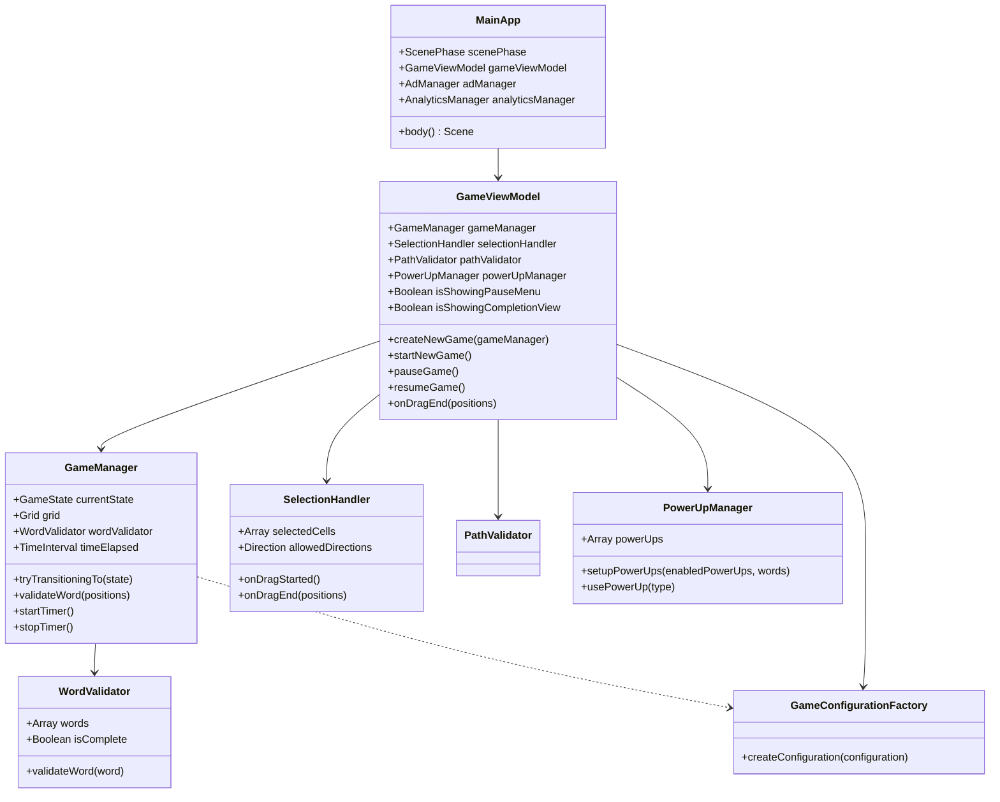
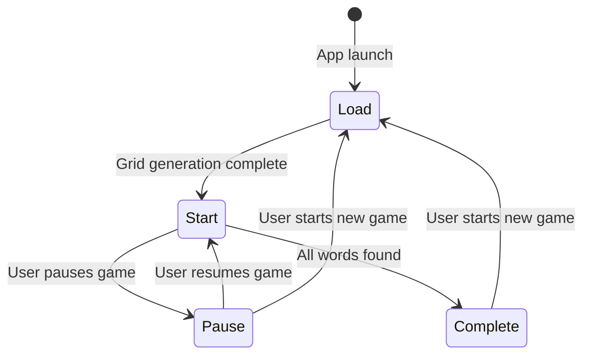
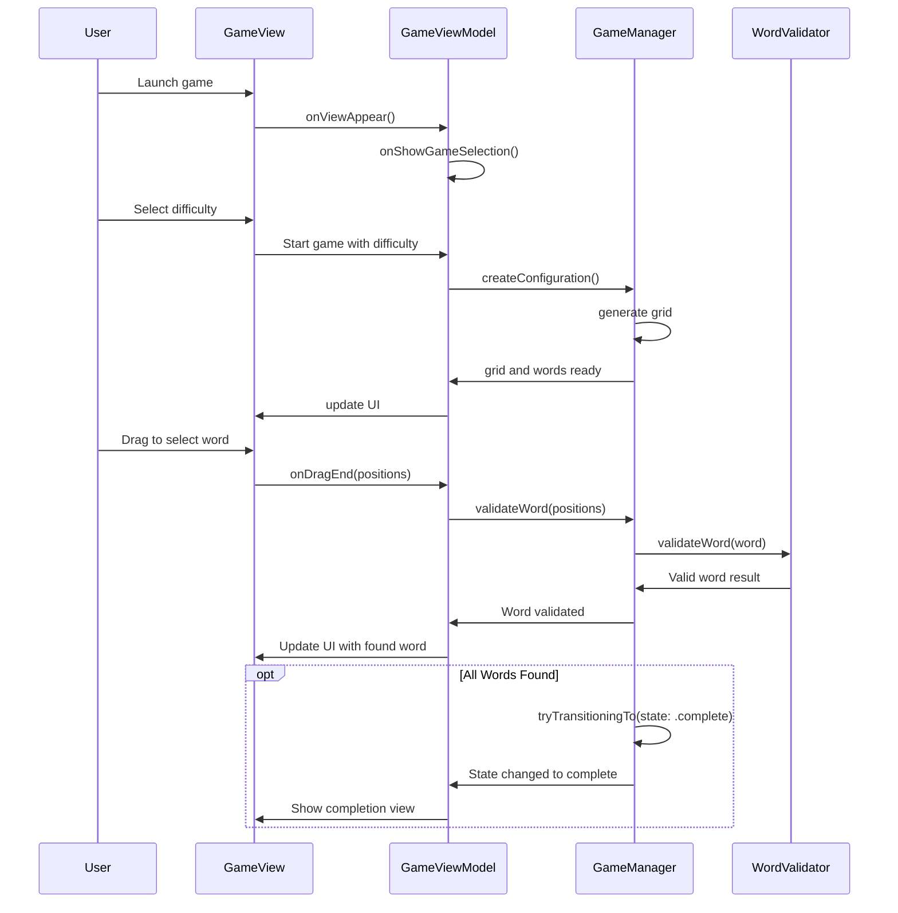
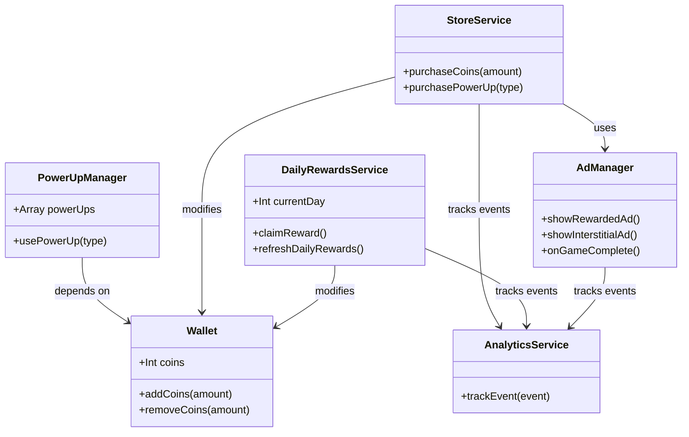
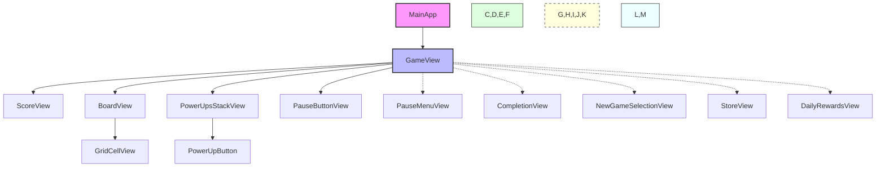
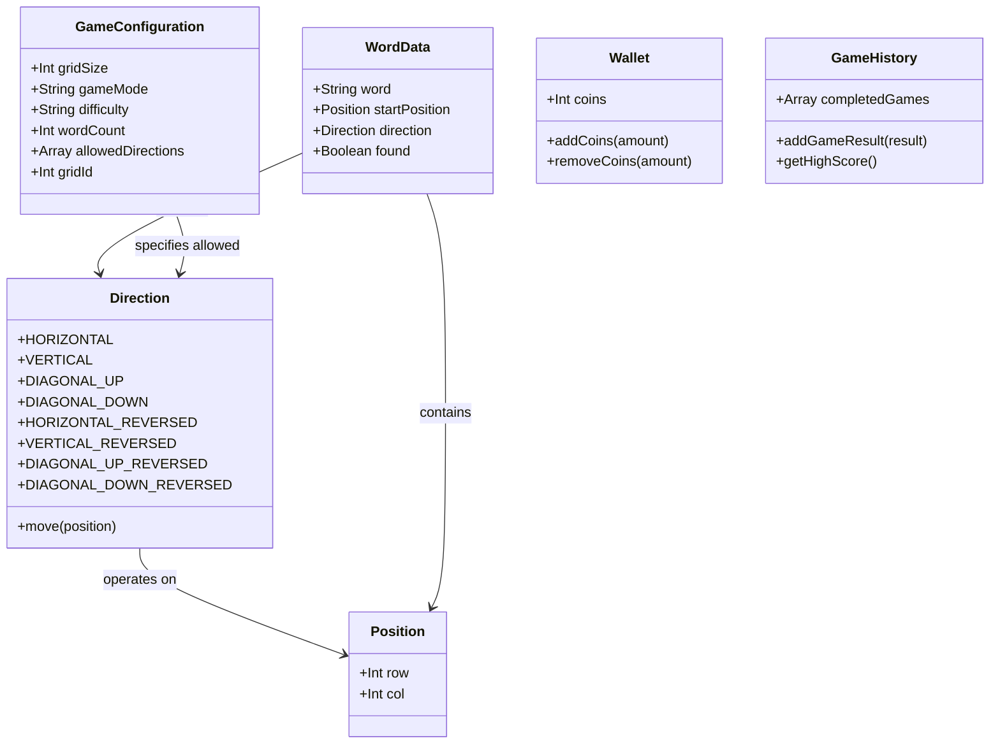
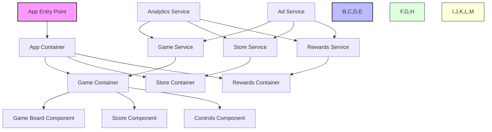

# WordSeekr Game - Technical Specification

## Overview

WordSeekr is a word search puzzle game built in Swift using SwiftUI. The game challenges players to find words in a grid of letters, with multiple difficulty levels, power-ups, daily rewards, and in-app purchases.

## Architecture

The application follows a modern architecture with the following key components:

### App Structure
- **Main Entry Point**: `MainApp.swift` as the SwiftUI application entry point
- **App Delegate**: Handles app lifecycle events and third-party services initialization
- **Scene Management**: Uses SwiftUI's scene phase to manage app states

### Design Pattern
- **MVVM Pattern**: View Models coordinate between models and views
- **Observable Objects**: Uses Swift's `@Observable` macro for state management
- **Dependency Injection**: Services and dependencies are injected via initializers

### Architecture Diagram



## Core Game Mechanics

### Game Board Generation
- Grid generation algorithms create letter grids of varying sizes
- Words are placed in the grid in different directions
- Remaining cells are filled with random letters
- Different difficulty levels modify grid size and word count

### Word Placement
- Words can be placed in multiple directions (horizontal, vertical, diagonal)
- The `Direction` enum defines possible word placements
- Path validation ensures words follow valid paths
- Words can only be placed within grid boundaries

### Word Selection and Validation
- Players select letters by dragging across the grid
- Selection paths are validated in real-time
- Only continuous paths along valid directions are accepted
- Selected words are checked against the target word list

### Game States
- **Loading**: Initial state when grid is being generated
- **Start**: Active gameplay
- **Pause**: Game timer is paused
- **Complete**: All words have been found
- **Load**: Loading new game configuration

### Game State Diagram



### Game Flow Sequence



## Features

### Game Modes
- **Classic Mode**: Find all words in a grid within time constraints
- **Time Attack**: Find words before time runs out
- **Categories**: Words grouped by themes or categories

### Difficulty Levels
- Very Easy, Easy, Medium, Hard, Very Hard
- Each level affects grid size, word count, and word placement difficulty
- Configuration maps define parameters for each difficulty level

### Power-Ups
- **Hint**: Reveals a word or partial word on the grid
- **Directional**: Shows possible directions for hidden words
- Power-ups can be purchased with in-game currency or earned

### Economy System
- Virtual currency (coins) for purchasing power-ups and unlocking features
- Daily rewards system for player retention
- In-app purchases for premium content and coin packs

### Analytics and Ads
- Firebase Analytics integration for tracking game events and user behavior
- Ad integration with banner ads and rewarded video ads
- Ad consent management for privacy compliance

### Feature Relationships



## User Interface

### Main Views
- **GameView**: Central game screen showing the letter grid and game controls
- **BoardView**: The interactive letter grid where players select words
- **ScoreView**: Shows game progress, timer, and score
- **PauseMenu**: Options when game is paused
- **CompletionView**: End-game summary showing results
- **StoreView**: In-app purchase interface for coins and items
- **DailyRewardsView**: Daily login rewards interface

### UI Components
- Letter grid with interactive cells
- Word list sidebar showing found and remaining words
- Power-up buttons and indicators
- Timer and score displays
- Progress indicators

### UI Component Hierarchy



## Services and Managers

### GameManager
- Central coordinator for game state and logic
- Manages the game timer and scoring
- Coordinates word validation and game progression

### GameConfigurationFactory
- Creates game configurations based on difficulty levels
- Determines grid size, word count, and placement rules

### AdManager
- Handles ad loading, display, and rewarded ad callbacks
- Manages ad consent and privacy requirements

### AnalyticsService
- Tracks user actions and game events
- Provides insights on user behavior and feature usage

### StoreService
- Manages in-app purchases and virtual currency
- Handles purchase validation and receipt verification

### DailyRewardsService
- Tracks daily login streaks
- Provides increasing rewards for consecutive logins

## Data Models

### Core Game Models
- **Position**: Represents a cell position (row, column) in the grid
- **Direction**: Defines possible word placement directions
- **GameConfiguration**: Contains grid size, words, and game parameters
- **WordData**: Word information including text, start position, and direction

### Player Data
- **Wallet**: Tracks player's virtual currency
- **GameHistory**: Records past game sessions and performance

### Data Model Relationships



## Persistence

### Local Storage
- User preferences and settings
- Game progress and high scores
- Daily rewards tracking
- Virtual currency balance

### Remote Database
- Word lists and game configurations
- User accounts and progress (if applicable)
- Leaderboards and achievements

## Third-Party Integrations

### Google Mobile Ads (AdMob)
- Banner ads
- Interstitial ads
- Rewarded video ads

### Firebase
- Analytics
- Remote Config
- Crash Reporting

## Technical Requirements for TypeScript Implementation

### Front-End Framework
- React or React Native for UI components
- TypeScript for type-safe code
- State management library (Redux or Context API)

### Grid Implementation
- Canvas-based rendering for performance
- Touch/mouse event handling for word selection
- Efficient grid updates and animations

### Game Logic
- Word placement algorithms
- Path validation
- Timer implementation
- Score calculation

### Mobile Considerations
- Responsive design for different screen sizes
- Touch input optimization
- Battery usage optimization for timer-based features

### TypeScript Implementation Architecture



## Data Structures

### Grid
```typescript
type Grid = string[][];
```

### Position
```typescript
interface Position {
  row: number;
  col: number;
}
```

### Direction
```typescript
enum Direction {
  HORIZONTAL,
  VERTICAL,
  DIAGONAL_UP,
  DIAGONAL_DOWN,
  HORIZONTAL_REVERSED,
  VERTICAL_REVERSED,
  DIAGONAL_UP_REVERSED,
  DIAGONAL_DOWN_REVERSED
}
```

### Word Data
```typescript
interface WordData {
  word: string;
  startPosition: Position;
  direction: Direction;
  found: boolean;
}
```

### Game Configuration
```typescript
interface GameConfiguration {
  gridSize: number;
  gameMode: string;
  difficulty: string;
  wordCount: number;
  allowedDirections: Direction[];
  gridId: number;
}
```

## Future Considerations

### Multiplayer
- Real-time competitive gameplay
- Shared puzzles and challenges

### Additional Features
- Custom word lists and user-created puzzles
- Social sharing and challenges
- Advanced power-ups and mechanics
- Themes and visual customization

## Implementation Strategy

1. Core game mechanics and grid generation
2. UI components and interaction
3. Game states and progression
4. Economy system and power-ups
5. Analytics and monetization
6. Polish and performance optimization

This technical specification provides a comprehensive overview of the WordSeekr game, its architecture, features, and implementation details to guide future development in TypeScript. 